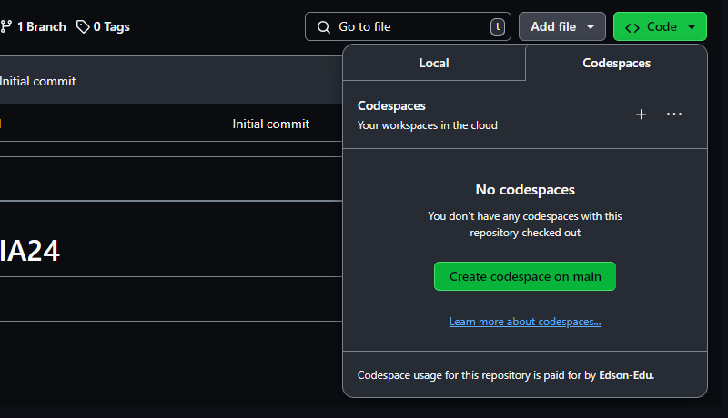

### Autenticação x Autorização

- Autenticação é quando o sistema verifica se você é mesmo quem diz ser, como um porteiro que confere sua identidade na entrada. Pode ser com senha, e-mail ou até biometria (impressão digital ou rosto). Já a **autorização** é o que te dá permissão para acessar certas áreas ou funções depois de entrar. É como ter acesso a certas salas dentro de um prédio — só porque você entrou, não significa que pode ir em todos os lugares.


### Vamos começar o tutorial! Primeiro, crie um repositório com o nome "2024-IA24-Login-Autenticacao".
#### Lembre-se: o repositório deve ser público e com o arquivo README incluso.


### Agora, nesta tela, você vai clicar no botão `Code` > `Codespace on main`.


# Configurando o Ambiente

Siga os passos abaixo, executando os comandos no terminal um de cada vez:

1. **Inicialize o projeto Node.js:**
    ```bash
    npm init -y
    ```

2. **Instale as dependências principais:**
    ```bash
    npm install express cors sqlite3 sqlite
    ```

3. **Instale as dependências de desenvolvimento:**
    ```bash
    npm install --save-dev typescript nodemon ts-node @types/express @types/cors
    ```

4. **Inicialize o TypeScript no projeto:**
    ```bash
    npx tsc --init
    ```

5. **Crie as pastas necessárias para a organização do projeto:**
    ```bash
    mkdir src public src/services src/utils
    ```

6. **Criando os arquivos essenciais para o projeto:**
    ```bash
    touch src/app.ts src/database.ts public/index.html public/main.css public/index.css public/main.html public/main.js initial-users.json src/services/user.services.ts src/utils/addAliasDots.ts src/utils/index.ts
    ```

# Index.html
### Dentro da pasta ``public``, voce encontrara o arquivo ``index.html`` e adicione:

````<!DOCTYPE html>
<html lang="en">

<head>
  <meta charset="UTF-8">
  <meta name="viewport" content="width=device-width, initial-scale=1.0">
  <title>AUTENTICAÇÃO X AUTORIZAÇÃO </title>
  <link rel="stylesheet" href="index2.css">
  <script defer src=main.js></script>
</head>

<body>
  <h1>AUTENTICAÇÃO X AUTORIZAÇÃO</h1>
  
  <form>
    <div>
      <label for="username">Username:</label>
      <input type="text" id="username" name="username">
    </div>
    <div>
      <label for="password">Password:</label>
      <input type="password" id="password" name="password">
    </div>
    <button>Login</button>
  </form>

  <button class="get-token">Get Token User</button>
  <button class="get-users">Get Users</button>
  <button class="logout">Logout</button>

 
  <pre> 
    ...
  </pre>


</body>

</html>
````

### Este arquivo está definindo a base estrutural da página de autenticação.

# Main.js
### Dentro da pasta ```public```, voce encontrara o arquivo ``main.js`` e adicione:

````javascript 
const pre = document.querySelector('pre')

// LOGIN
const form = document.querySelector('form')
form.addEventListener('submit', async (event) => {
  event.preventDefault();
  const username = form.username.value
  const password = form.password.value
  const response = await fetch('/token', {
    method: 'POST',
    headers: { 'Content-Type': 'application/json' },
    body: JSON.stringify({ username, password })
  })
  const data = await response.json()
  pre.textContent = response.status + "\n" + JSON.stringify(data, null, 2)
  if (!response.ok) {
    console.error('Login failed', data)
    if (data.token)
      localStorage.setItem('token', data.token)
    alert('Login failed')
    return
  }

  console.log('Login success', data)
  window.location.href="main.html";
 
  localStorage.setItem('token', data.token)

})

document.querySelector('button.get-token').addEventListener('click', async () => {
  const token = localStorage.getItem('token')
  const response = await fetch(`/token/${token}`)
  const data = await response.json()
  pre.textContent = response.status + "\n" + JSON.stringify(data, null, 2)
  if (!response.ok) {
    console.error('Token failed', data)
    alert('Token failed')
    return
  }
  console.log('Token success', data)
})

document.querySelector('button.get-users').addEventListener('click', async () => {
  const token = localStorage.getItem('token')
  const response = await fetch(`/users/${token}`)
  const data = await response.json()
  pre.textContent = response.status + "\n" + JSON.stringify(data, null, 2)
  if (!response.ok) {
    console.error('Get users failed', data)
    alert('Get users failed')
    return
  }
  console.log('Get users success', data)
})  

document.querySelector('button.logout').addEventListener('click', async () => {
  const token = localStorage.getItem('token')
  const response = await fetch(`/token/${token}`, { method: 'DELETE' })
  pre.textContent = response.status
  if (!response.ok) {
    console.error('Logout failed')
    alert('Logout failed')
    return
  }
  console.log('Logout success')
  localStorage.removeItem('token')
})

````
### O código gerencia o login, verificação de token, listagem de usuários e logout. Ele faz isso enviando dados de login para o servidor, armazenando o token recebido, e permitindo ações como verificar o token, obter a lista de usuários e fazer logout, atualizando a interface com o status e os dados das operações.


### 1. **Selecionando Elementos**
```javascript
const pre = document.querySelector('pre')
const form = document.querySelector('form')
```
- Seleciona o elemento `<pre>` para exibir respostas e o formulário para capturar dados de login.

### 2. **Login**
```javascript
form.addEventListener('submit', async (event) => {
  event.preventDefault();
  const username = form.username.value
  const password = form.password.value
  const response = await fetch('/token', {
    method: 'POST',
    headers: { 'Content-Type': 'application/json' },
    body: JSON.stringify({ username, password })
  })
  const data = await response.json()
  pre.textContent = response.status + "\n" + JSON.stringify(data, null, 2)
  if (!response.ok) {
    console.error('Login failed', data)
    if (data.token)
      localStorage.setItem('token', data.token)
    alert('Login failed')
    return
  }
  console.log('Login success', data)
  window.location.href="main.html";
  localStorage.setItem('token', data.token)
})
```
- Captura os dados de login do formulário e os envia para o servidor.
- Exibe o status da resposta e os dados no elemento `<pre>`.
- Se o login for bem-sucedido, armazena o token e redireciona para a página principal.

### 3. **Verificação do Token**
```javascript
document.querySelector('button.get-token').addEventListener('click', async () => {
  const token = localStorage.getItem('token')
  const response = await fetch(`/token/${token}`)
  const data = await response.json()
  pre.textContent = response.status + "\n" + JSON.stringify(data, null, 2)
  if (!response.ok) {
    console.error('Token failed', data)
    alert('Token failed')
    return
  }
  console.log('Token success', data)
})
```
- Quando o botão "Get Token" é clicado, o código verifica o token armazenado e exibe o status e dados recebidos.

### 4. **Listagem de Usuários**
```javascript
document.querySelector('button.get-users').addEventListener('click', async () => {
  const token = localStorage.getItem('token')
  const response = await fetch(`/users/${token}`)
  const data = await response.json()
  pre.textContent = response.status + "\n" + JSON.stringify(data, null, 2)
  if (!response.ok) {
    console.error('Get users failed', data)
    alert('Get users failed')
    return
  }
  console.log('Get users success', data)
})
```
- Quando o botão "Get Users" é clicado, o código usa o token para obter a lista de usuários e exibe o status e dados.

### 5. **Logout**
```javascript
document.querySelector('button.logout').addEventListener('click', async () => {
  const token = localStorage.getItem('token')
  const response = await fetch(`/token/${token}`, { method: 'DELETE' })
  pre.textContent = response.status
  if (!response.ok) {
    console.error('Logout failed')
    alert('Logout failed')
    return
  }
  console.log('Logout success')
  localStorage.removeItem('token')
})
```

---

### O que é um token?

Pense em um token como uma pulseira que você recebe ao entrar em uma festa exclusiva. Quando você faz login em um site, o token é sua “pulseira digital” que prova que você tem acesso às áreas restritas. Com ele, você pode navegar pelo site sem ter que repetir seu login o tempo todo. É uma forma segura e prática de garantir que você está autorizado a acessar certas informações ou funcionalidades. 


# main.html
### Dentro da pasta ```public```, voce encontrara o arquivo ``main.html`` e adicione:

````html
<!DOCTYPE html>
<html lang="pt-BR">

<head>
  <meta charset="UTF-8">
  <meta name="viewport" content="width=device-width, initial-scale=1.0">
  <link rel="stylesheet" href="index.css">
  <title>pagina principal</title>
</head>

<body>
  <div class="container">
   
    <table>
      <thead>
        <tr>
          <th>Id</th>
          <th>Nome</th>
          <th>Email</th>
          <th>Ações</th>
        </tr>
      </thead>
      <tbody>
        <!--  -->
      </tbody>
    </table>
  </div>

  <script>
    const form = document.querySelector('form')
    const tbody = document.querySelector('tbody')

    async function fetchData() {
      const resp = await fetch('/users/' + localStorage.getItem('token'))
      const data = await resp.json()

      tbody.innerHTML = ''

      data.forEach(user => {
        const tr = document.createElement('tr')
        tr.innerHTML = `
          <td>${user.id}</td>
          <td>${user.name}</td>
          <td>${user.email}</td>
          <td>
            <button class="excluir">Excluir</button>
            <button class="editar">Editar</button>
          </td>
        `

        const btExcluir = tr.querySelector('button.excluir')
        const btEditar = tr.querySelector('button.editar')
        const token = localStorage.getItem('token');
        console.log(token);
        btExcluir.addEventListener('click', async () => {
          const resp = await fetch(`/users/${user.id}/${token}`, { method: 'DELETE' })
          if(resp.status == 401){
            alert("Voce nao tem permissão");
            return
          }
          tr.remove()
        })

        btEditar.addEventListener('click', async () => {
          const name = prompt('Novo nome:', user.name)
          const email = prompt('Novo email:', user.email)

          const resp =  await fetch(`/users/${user.id}/${token}`, {
            method: 'PUT',
            headers: { 'Content-Type': 'application/json' },
            body: JSON.stringify({ name, email })
          })

          if (resp.status == 401) {
            alert("Voce nao tem permissão")
            return 
          }

          fetchData()
        })

        tbody.appendChild(tr)
      })
    }

    fetchData()
  </script>
</body>

</html>
````

### Este arquivo configura a interface para administrar os usuários depois que você faz login.


### Dentro da pasta ```public```, voce encontrara o arquivo ``main.css`` e adicione:

````css

* {
    box-sizing: border-box;
    margin: 0;
    padding: 0;
    font-family: 'Segoe UI', Tahoma, Geneva, Verdana, sans-serif;
}

body {
    background-color: #f7f7f7;
    color: #333;
    line-height: 1.6;
}

h1 {
    text-align: center;
    margin-bottom: 30px;
    color: #333;
    font-size: 2.5em;
}

p {
    margin-bottom: 15px;
    color: #555;
    text-align: center;
}

/* Form Styles */

form {
    max-width: 350px;
    margin: 50px auto;
    padding: 25px;
    background-color: #ffffff;
    border: 1px solid #ddd;
    border-radius: 8px;
    box-shadow: 0 4px 8px rgba(0, 0, 0, 0.1);
}

form div {
    margin-bottom: 25px;
}

label {
    display: block;
    margin-bottom: 8px;
    font-weight: bold;
    color: #333;
}

input[type="text"], input[type="password"] {
    width: 100%;
    height: 45px;
    padding: 10px;
    border: 1px solid #ccc;
    border-radius: 5px;
    font-size: 1em;
    color: #333;
}

input[type="text"]:focus, input[type="password"]:focus {
    border-color: #4CAF50;
    outline: none;
    box-shadow: 0 0 5px rgba(76, 175, 80, 0.2);
}

button[type="submit"] {
    background-color: #4CAF50;
    color: #fff;
    padding: 12px 24px;
    border: none;
    border-radius: 5px;
    cursor: pointer;
    font-size: 1em;
}

button[type="submit"]:hover {
    background-color: #45a049;
}

/* Button Styles */

.get-token, .get-users, .logout {
    display: inline-block;
    margin-top: 15px;
    margin-right: 10px;
    padding: 12px 24px;
    border: none;
    border-radius: 5px;
    cursor: pointer;
    font-size: 1em;
    color: #fff;
}

.get-token {
    background-color: #007bff;
}

.get-token:hover {
    background-color: #0056b3;
}

.get-users {
    background-color: #28a745;
}

.get-users:hover {
    background-color: #218838;
}

.logout {
    background-color: #dc3545;
}

.logout:hover {
    background-color: #c82333;
}

/* Pre Styles */

pre {
    background-color: #ffffff;
    padding: 15px;
    border: 1px solid #ddd;
    border-radius: 5px;
    overflow: auto;
    font-family: 'Courier New', Courier, monospace;
}

````
### Dentro da pasta ```public```, voce tambem encontrara o arquivo ``index.css`` e adicione:

````css
html, body {
  height: 100%;
  margin: 0;
  padding: 0;
  font-family: 'Arial', sans-serif;
  background: #e9ecef;
}

body {
  display: flex;
  justify-content: center;
  align-items: center;
  padding: 20px;
}

.container {
  background: #ffffff;
  border-radius: 12px;
  padding: 20px;
  width: 90%;
  max-width: 900px;
  box-shadow: 0 8px 16px rgba(0, 0, 0, 0.2);
  transition: box-shadow 0.3s, transform 0.3s;
}

.container:hover {
  transform: translateY(-5px);
  box-shadow: 0 12px 24px rgba(0, 0, 0, 0.3);
}

h1 {
  font-size: 2.4em;
  color: #333;
  margin-bottom: 20px;
}

h3 {
  font-size: 1.4em;
  color: #555;
  margin-bottom: 20px;
}

form {
  margin-bottom: 20px;
}

form input[type="text"],
form input[type="email"],
form input[type="password"] {
  padding: 10px;
  border: 1px solid #ccc;
  border-radius: 6px;
  margin: 5px 0;
  width: calc(100% - 22px);
  background-color: #f8f9fa;
  color: #333;
  transition: border-color 0.3s, box-shadow 0.3s;
}

form input[type="text"]:focus,
form input[type="email"]:focus {
  border-color: #007bff;
  box-shadow: 0 0 4px rgba(0, 123, 255, 0.3);
}

form button {
  padding: 10px 20px;
  border: none;
  border-radius: 6px;
  background-color: #007bff;
  color: #ffffff;
  cursor: pointer;
  font-size: 1em;
  transition: background-color 0.3s, transform 0.3s;
}

form button:hover {
  background-color: #0056b3;
  transform: scale(1.03);
}

table {
  width: 100%;
  border-collapse: collapse;
  margin-top: 20px;
}

table th, table td {
  padding: 10px;
  border: 1px solid #ddd;
  color: #333;
  text-align: left;
  transition: background-color 0.3s;
}

table th {
  background-color: #f1f1f1;
  color: #333;
}

table td {
  background-color: #ffffff;
}

table button {
  padding: 5px 10px;
  border: none;
  border-radius: 4px;
  color: #ffffff;
  cursor: pointer;
  font-size: 0.9em;
  margin: 2px;
  transition: background-color 0.3s, transform 0.3s;
}

table button.excluir {
  background-color: #dc3545;
}

table button.excluir:hover {
  background-color: #c82333;
}

table button.editar {
  background-color: #28a745;
}

table button.editar:hover {
  background-color: #218838;
}


# Services

### Dentro da pasta ```src```, voce encontrara outra pasta chamada ``services``, dentro dela tera o arquivo ``user.services.ts`` e nele adicione:
(Vai dar erro, mas é só seguir o tuturial normalmente)

````ts
import { database  } from "../database"

export const findUserByLoginPassword = async (username: string, password: string) => {
  const db = await database()
  return db.get(`SELECT * FROM users WHERE username = ? AND password = ? LIMIT 1`, [username, password])
}

export const getAllUsers = async () => {
  const db = await database()
  return db.all(`SELECT id, name, email, username FROM users`)
}
````

### Este código é responsável por interagir com o banco de dados para gerenciar usuários. Veja uma breve explicação.

1. **Procurar Usuário pelo Nome de Usuário e Senha:**
   ```javascript
   export const findUserByLoginPassword = async (username: string, password: string) => {
     const db = await database()
     return db.get(`SELECT * FROM users WHERE username = ? AND password = ? LIMIT 1`, [username, password])
   }
   ```
   - **O que faz:** Esta função procura um usuário específico no banco de dados usando o nome de usuário e a senha fornecidos.
   - **Como faz:** Abre uma conexão com o banco de dados, executa uma consulta para encontrar um usuário com o nome e senha correspondentes, e retorna os detalhes desse usuário (ou nada, se não houver correspondência).

2. **Obter Todos os Usuários:**
   ```javascript
   export const getAllUsers = async () => {
     const db = await database()
     return db.all(`SELECT id, name, email, username FROM users`)
   }
   ```
   - **O que faz:** Esta função obtém uma lista de todos os usuários armazenados no banco de dados.
   - **Como faz:** Abre uma conexão com o banco de dados e executa uma consulta para pegar todos os usuários, retornando suas IDs, nomes, e-mails e nomes de usuário.

Essas funções ajudam a buscar um usuário específico quando ele faz login e a listar todos os usuários armazenados no banco de dados.


# Utils
### Dentro da pasta ```src```, voce encontrara outra pasta chamada ``utils``, dentro dela tera o arquivo ``addAliasDots.ts`` e nele adicione:

````ts
export default function addAliasDots(obj: any) {
    let newObj: any = {}
    for (let key in obj) {
      newObj[`:${key}`] = obj[key]
    }
    return newObj
  }
````

### O Que Este Código Faz?

Essa função é responsável por adicionar um prefixo a todas as chaves de um objeto. Vamos ver como funciona:

```javascript
export default function addAliasDots(obj: any) {
  let newObj: any = {}
  for (let key in obj) {
    newObj[`:${key}`] = obj[key]
  }
  return newObj
}
```

1. **Recebe um Objeto:**
   - A função `addAliasDots` recebe um objeto `obj` como entrada.

2. **Cria um Novo Objeto:**
   - Dentro da função, um novo objeto `newObj` é criado para armazenar os resultados.

3. **Adiciona Prefixo às Chaves:**
   - A função percorre todas as chaves do objeto original (`obj`).
   - Para cada chave, ela adiciona um prefixo `:` e armazena o valor correspondente no novo objeto `newObj`. 
   - Por exemplo, se a chave original é `name`, no novo objeto ela se tornará `:name`.

4. **Retorna o Novo Objeto:**
   - Após adicionar o prefixo a todas as chaves, a função retorna o novo objeto.

### Exemplo:

Se você passar um objeto como este:

```javascript
const originalObj = {
  name: 'John',
  age: 30
}
```

A função `addAliasDots` retornará:

```javascript
{
  ':name': 'John',
  ':age': 30
}
```

### Dentro da pasta ```src```, voce encontrara outra pasta chamada ``utils``, dentro dela tera o arquivo ``index.ts`` e nele adicione:

````ts
export { default as addAliasDots } from "./addAliasDots"
````


# App.ts
### Dentro da pasta ```src```, voce encontrara o arquivo ``app.ts`` e adicione:

````ts
import express, { RequestHandler } from 'express'
import * as userServices from './services/user.services'
import { randomUUID } from 'crypto'
import { database } from './database';

const port = 3000
const app = express()

app.use(express.json())
app.use(express.static(__dirname + '/../public'))

type user = { id: number, name: string, email: string, username: string, password: string }
const logged: { [token: string]: user } = {}


/**
 * Esta função verifica por username se já existem tokem criado para o usuário
 * @param username 
 * @returns 
 */
const isAlreadyLogged = (username: string) => {
  for (const token in logged)
    if (logged[token].username === username)
      return token
  return false
}

// Check if user is logged middleware
const middlewareLogged: RequestHandler = (req, res, next) => {
  const token = req.params.token
  if (!token)
    return res.status(404).json({ error: "Token não informado" })
  if (!logged[token])
    return res.status(401).json({ error: "Token inválido" })
  next()
}

const middlewareSouDono: RequestHandler = (req, res, next) => {
  const { id, token } = req.params;
  if (!logged[token]) {
    return res.status(401).json({ error: "Token inválido" });
  }
  if (logged[token].id+"" !== id) {
    return res.status(401).json({ error: "Você não tem permissão para atualizar este usuário" });
  }
  next()
}

// TOKEN CREATE :: LOGIN
app.post("/token", async (req, res) => {
  const { username, password } = req.body
  const tokenAlread = isAlreadyLogged(username)
  if (tokenAlread)
    return res.status(401).json({
      error: "Usuário já está logado", 
      token: tokenAlread
    })
  const user = await userServices.findUserByLoginPassword(username, password)
  if (!user)
    return res.status(401).json({ error: "Usuário ou senha inválidos" })
  const token = randomUUID()
  logged[token] = user
  return res.json({ token })
})

app.put('/users/:id/:token', middlewareSouDono, async (req, res) => {
  const db = await database();
  const { id, token } = req.params;
  const { name, email } = req.body;
  const userId = parseInt(id, 10);    
  await db.run('UPDATE users SET name = ?, email = ? WHERE id = ?', [name, email, userId]);
  const user = await db.get('SELECT * FROM users WHERE id = ?', [userId]);

  res.json(user);
});


app.delete('/users/:id/:token', middlewareSouDono, async (req, res) => {
  const db = await database();
  const { id } = req.params;
  await db.run('DELETE FROM users WHERE id = ?', [id]);
  res.json({ message: 'User deleted' });
});

app.get("/users/:token", middlewareLogged, async (req, res) => {
  const users = await userServices.getAllUsers()
  return res.json(users)
})


// TOKEN CHECK :: VALIDATE
app.get("/token/:token", (req, res) => {
  const token = req.params.token
  if (!token)
    return res.status(401).json({ error: "Token não informado" })
  if (!logged[token])
    return res.status(401).json({ error: "Token inválido" })
  return res.json({ ...logged[token], password: undefined })
})

// TOKEN DELETE :: LOGOUT
app.delete("/token/:token", (req, res) => {
  const token = req.params.token
  if (!token)
    return res.status(401).json({ error: "Token não informado" })
  if (!logged[token])
    return res.status(401).json({ error: "Token inválido" })
  delete logged[token]
  return res.status(204).send()
})

// LISTAR USUÁRIOS SOMENTE SE ESTIVER LOGADO
app.get("/users/:token", middlewareLogged, async (req, res) => {
  const users = await userServices.getAllUsers()
  return res.json(users)
})

app.listen(port, () => console.log(`⚡ Server is running on port ${port}`))
````
Claro! Vamos detalhar o que cada parte do código faz de uma forma mais clara:

---

### O Que Este Código Faz?

Este código configura um servidor Express que gerencia usuários e autenticação.

#### 1. **Configuração Inicial**

- **Importações e Configuração:**
  ```javascript
  import express, { RequestHandler } from 'express'
  import * as userServices from './services/user.services'
  import { randomUUID } from 'crypto'
  import { database } from './database';
  
  const port = 3000
  const app = express()
  ```
  - **Express:** Framework para criar o servidor.
  - **Funções e Módulos:** Importa funções para lidar com usuários, gerar tokens únicos e acessar o banco de dados.

- **Middlewares:**
  ```javascript
  app.use(express.json())
  app.use(express.static(__dirname + '/../public'))
  ```
  - **`express.json()`:** Permite que o servidor entenda e processe requisições com JSON.
  - **`express.static()`:** Serve arquivos estáticos, como HTML e CSS, da pasta `public`.

#### 2. **Gerenciamento de Tokens**

- **Armazenamento de Tokens:**
  ```javascript
  const logged: { [token: string]: user } = {}
  ```
  - **`logged`:** Guarda tokens e os usuários associados, permitindo rastrear quem está logado com cada token.

- **Função `isAlreadyLogged`:**
  ```javascript
  const isAlreadyLogged = (username: string) => {
    for (const token in logged)
      if (logged[token].username === username)
        return token
    return false
  }
  ```
  - **Verifica se um usuário já está logado**, procurando um token existente para o nome de usuário fornecido.

#### 3. **Middlewares**

- **`middlewareLogged`:** 
  ```javascript
  const middlewareLogged: RequestHandler = (req, res, next) => {
    const token = req.params.token
    if (!token)
      return res.status(404).json({ error: "Token não informado" })
    if (!logged[token])
      return res.status(401).json({ error: "Token inválido" })
    next()
  }
  ```
  - **Verifica se o token na requisição é válido.**

- **`middlewareSouDono`:**
  ```javascript
  const middlewareSouDono: RequestHandler = (req, res, next) => {
    const { id, token } = req.params;
    if (!logged[token]) {
      return res.status(401).json({ error: "Token inválido" });
    }
    if (logged[token].id+"" !== id) {
      return res.status(401).json({ error: "Você não tem permissão para atualizar este usuário" });
    }
    next()
  }
  ```
  - **Verifica se o token pertence ao usuário que está tentando modificar informações**.

#### 4. **Endpoints da API**

- **Criar Token (Login):**
  ```javascript
  app.post("/token", async (req, res) => {
    const { username, password } = req.body
    const tokenAlread = isAlreadyLogged(username)
    if (tokenAlread)
      return res.status(401).json({
        error: "Usuário já está logado", 
        token: tokenAlread
      })
    const user = await userServices.findUserByLoginPassword(username, password)
    if (!user)
      return res.status(401).json({ error: "Usuário ou senha inválidos" })
    const token = randomUUID()
    logged[token] = user
    return res.json({ token })
  })
  ```
  - **Cria um novo token de autenticação** se o login for bem-sucedido e o usuário ainda não estiver logado.

- **Verificar Token:**
  ```javascript
  app.get("/token/:token", (req, res) => {
    const token = req.params.token
    if (!token)
      return res.status(401).json({ error: "Token não informado" })
    if (!logged[token])
      return res.status(401).json({ error: "Token inválido" })
    return res.json({ ...logged[token], password: undefined })
  })
  ```
  - **Verifica se um token é válido** e retorna as informações do usuário associado, sem a senha.

- **Deletar Token (Logout):**
  ```javascript
  app.delete("/token/:token", (req, res) => {
    const token = req.params.token
    if (!token)
      return res.status(401).json({ error: "Token não informado" })
    if (!logged[token])
      return res.status(401).json({ error: "Token inválido" })
    delete logged[token]
    return res.status(204).send()
  })
  ```
  - **Remove um token** e faz logout do usuário.

- **Atualizar Usuário:**
  ```javascript
  app.put('/users/:id/:token', middlewareSouDono, async (req, res) => {
    const db = await database();
    const { id, token } = req.params;
    const { name, email } = req.body;
    const userId = parseInt(id, 10);    
    await db.run('UPDATE users SET name = ?, email = ? WHERE id = ?', [name, email, userId]);
    const user = await db.get('SELECT * FROM users WHERE id = ?', [userId]);
    res.json(user);
  });
  ```
  - **Atualiza o nome e o e-mail** de um usuário, se o token for válido e pertencer ao usuário.

- **Excluir Usuário:**
  ```javascript
  app.delete('/users/:id/:token', middlewareSouDono, async (req, res) => {
    const db = await database();
    const { id } = req.params;
    await db.run('DELETE FROM users WHERE id = ?', [id]);
    res.json({ message: 'User deleted' });
  });
  ```
  - **Deleta um usuário** do banco de dados, se o token for válido e pertencer ao usuário.

- **Listar Usuários:**
  ```javascript
  app.get("/users/:token", middlewareLogged, async (req, res) => {
    const users = await userServices.getAllUsers()
    return res.json(users)
  })
  ```
  - **Lista todos os usuários**, mas somente se o token for válido.

#### 5. **Inicialização do Servidor**

```javascript
app.listen(port, () => console.log(`⚡ Server is running on port ${port}`))
```
- **Inicia o servidor na porta 3000** e exibe uma mensagem no console indicando que o servidor está ativo.

---

Em resumo, este código configura um servidor que gerencia autenticação de usuários com tokens e permite realizar operações de CRUD (Criar, Ler, Atualizar e Deletar) sobre usuários, tudo de forma segura e com verificação de permissões.

# database.ts
### Dentro da pasta ```src```, voce encontrara o arquivo ``database.ts`` e adicione:

````ts
import { open, Database } from "sqlite"
import { Database as driver } from "sqlite3"
import { addAliasDots as dots } from "./utils"

let instance: Database | null = null

const filename = "./database.sqlite"

export const database = async () => {
  if (instance)
    return instance

  const db =
    await open({ filename, driver })

  await db.exec(`
    CREATE TABLE IF NOT EXISTS users (
      id INTEGER PRIMARY KEY AUTOINCREMENT,
      name TEXT NOT NULL,
      email TEXT NOT NULL,
      username TEXT NOT NULL,
      password TEXT NOT NULL
    )
  `)

  const users: any[] = require("../initial-users.json")
  users.forEach(async user => await db.run(`
      INSERT INTO users (name, email, username, password) 
      SELECT :name, :email, :username, :password
      WHERE NOT EXISTS (SELECT 1 FROM users WHERE username = :username)
    `, dots(user)
  ))

  return instance = db
}

database()
````
### Este arquivo está configurando o banco de dados para o projeto.

# Usuarios
### No arquivo ``initial-users.json`` adicione: 
````json
[
  {
    "name": "Lucas Almeida",
    "email": "lucas.almeida@example.com",
    "username": "lucas123",
    "password": "securepassword1"
  },
  {
    "name": "Ana Pereira",
    "email": "ana.pereira@example.com",
    "username": "ana456",
    "password": "securepassword2"
  }
]

````
### Este arquivo está criando um conjunto inicial de usuários para o banco de dados.


# Package.json

### No arquivo ``package.json`` substitua tudo por:
````json
{
  "name": "2024-ia22-2tri",
  "version": "1.0.0",
  "description": "Programação II",
  "main": "index.js",
  "scripts": {
    "test": "echo \"Error: no test specified\" && exit 1",
    "dev": "npx nodemon src/app.ts"
  },
  "keywords": [],
  "author": "",
  "license": "ISC",
  "dependencies": {
    "cors": "^2.8.5",
    "express": "^4.19.2",
    "sqlite": "^5.1.1",
    "sqlite3": "^5.1.7"
  },
  "devDependencies": {
    "@types/cors": "^2.8.17",
    "@types/express": "^4.17.21",
    "nodemon": "^3.1.4",
    "ts-node": "^10.9.2",
    "typescript": "^5.5.4"
  }
}

````

# Executando

### Abra o terminal, digite `npm run dev` e pressione Enter.

### Acesse no seu navegador. Para isso, vá até a opção ``Portas`` e clique no seguinte icone.


### Na tela de login, insira o nome de usuário `lucas123` e a senha `securepassword1`, e clique no botão **Login**.


### Após o login, você será direcionado para a página principal, onde poderá ver todos os usuários cadastrados. 

### por fim! volte ao codespace e crie o arquivo .gitignore e cole isso:

````
node_modules/
dist/
````

e por ultimo...

só precisamos adicionar, comitar e subir as mudanças feitas para o GitHub. primeiro de tudo, abra o terminal e use `Ctrl + c` para fechar o servidor web e copie o script abaixo no terminal.
```
git add . ; git commit -m ... ; git push origin main
```

# Muito bem! chegamos ao fim do tutorial!

feito pelos alunos da IA22
Antony gabriel, Arthur Rodrigues, Iuri prestes, joão osório e Kallebi Borges